# Brand Central AI - Architectural Document

## Table of Contents
1. [High-Level Application Overview](#high-level-application-overview)
2. [System Architecture](#system-architecture)
3. [Main Components](#main-components)
4. [Key Data Models](#key-data-models)
5. [Core Workflows](#core-workflows)
6. [Technology Stack](#technology-stack)
7. [External Integrations](#external-integrations)
8. [Deployment Architecture](#deployment-architecture)
9. [Security Considerations](#security-considerations)
10. [Performance & Scalability](#performance--scalability)

## High-Level Application Overview

### Purpose
Brand Central AI is a guided, AI-powered web application that serves as the central operating system for brands. It transforms abstract branding concepts into interactive, actionable modules, providing a structured approach to brand development from positioning to content execution.

### Key Value Propositions
- **Guided Brand Development**: Step-by-step phased approach (10 phases) from brand positioning to analytics
- **AI-Powered Content Creation**: Leverages Google Gemini AI for content generation, brand validation, and strategy development
- **Integrated Workflow**: Seamless integration between brand strategy, content creation, and distribution
- **Brand Compliance**: Built-in brand guardian functionality to ensure content alignment with brand guidelines

### Target Users
- Brand managers and marketers
- Content creators and strategists
- Small to medium businesses developing their brand identity
- Marketing agencies managing multiple brand projects

## System Architecture

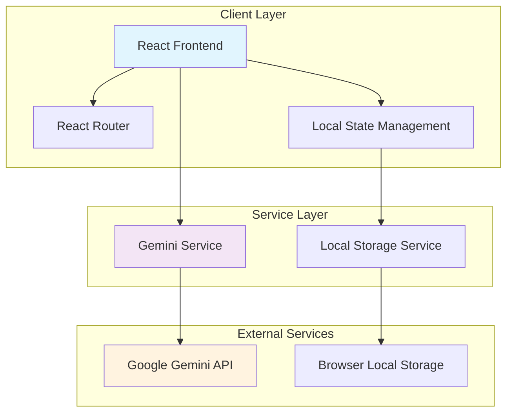

## Main Components

### 1. Frontend Architecture

The application follows a modular React architecture with the following key components:

```mermaid
graph TD
    App[App.tsx - Main Application]
    
    subgraph "Core Modules"
        Dashboard[Dashboard Module]
        WorldFoundry[World Foundry Module]
        ContentStudio[Content Studio Module]
        DistributionHub[Distribution Hub Module]
    end
    
    subgraph "Shared Components"
        Card[Card Component]
        Button[Button Component]
        Alert[Alert Component]
        LoadingSpinner[Loading Spinner]
    end
    
    subgraph "Dashboard Components"
        PhaseNavigator[Phase Navigator]
        MetricsWidget[North Star Metrics Widget]
        LMAICheck[L-M-A-I Check Tool]
        ActivityFeed[Recent Activity Feed]
    end
    
    subgraph "World Foundry Components"
        AudienceArchitect[Audience Architect]
        MacroFantasy[Macro Fantasy Generator]
        WorldBible[World Bible Editor]
        VisualIdentity[Visual Identity Kit Editor]
        CompetitiveAnalysis[Competitive Analysis Input]
    end
    
    subgraph "Content Studio Components"
        IdeaGenerator[Idea Generator]
        PromptEngineer[Prompt Engineer Tool]
        TemplateGenerator[Template-Based Generator]
        BrandGuardian[Brand Guardian]
        CommunityEngagement[Community Engagement Simulator]
    end
    
    App --> Dashboard
    App --> WorldFoundry
    App --> ContentStudio
    App --> DistributionHub
    
    Dashboard --> PhaseNavigator
    Dashboard --> MetricsWidget
    Dashboard --> LMAICheck
    Dashboard --> ActivityFeed
    
    WorldFoundry --> AudienceArchitect
    WorldFoundry --> MacroFantasy
    WorldFoundry --> WorldBible
    WorldFoundry --> VisualIdentity
    WorldFoundry --> CompetitiveAnalysis
    
    ContentStudio --> IdeaGenerator
    ContentStudio --> PromptEngineer
    ContentStudio --> TemplateGenerator
    ContentStudio --> BrandGuardian
    ContentStudio --> CommunityEngagement
    
    style App fill:#ffcdd2
    style Dashboard fill:#c8e6c9
    style WorldFoundry fill:#dcedc8
    style ContentStudio fill:#f8bbd9
    style DistributionHub fill:#b3e5fc
```

### 2. Backend Services

**Note**: This is a frontend-only application with no traditional backend. All data persistence is handled via browser Local Storage, and AI functionality is provided through direct API calls to Google Gemini.

### 3. Database Layer

**Local Storage Schema**:
- Key: `brandCentralAIData`
- Contains serialized `AppStateData` object with all application state
- Automatic persistence on state changes
- Graceful fallback for corrupted data

## Key Data Models

### Core Data Models

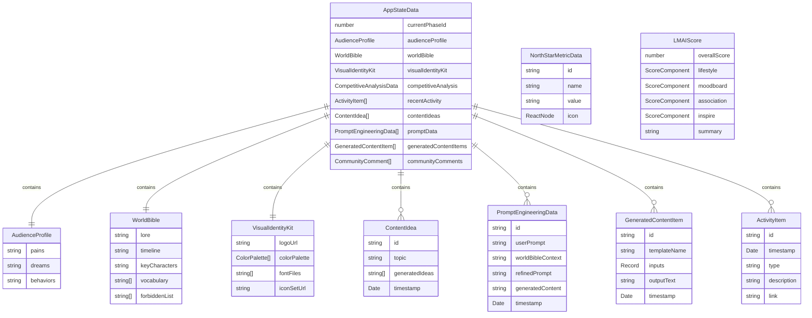

### Enums and Constants

```typescript
enum ModuleKey {
  Dashboard = 'Dashboard',
  WorldFoundry = 'WorldFoundry',
  ContentStudio = 'ContentStudio',
  DistributionHub = 'DistributionHub'
}

enum ActivityType {
  'Asset Created',
  'Post Scheduled',
  'Performance Alert',
  'Phase Advanced',
  'AI Task',
  'Brand Check',
  'Data Loaded',
  'Data Saved',
  'Error'
}
```

## Core Workflows

### 1. Brand Development Workflow

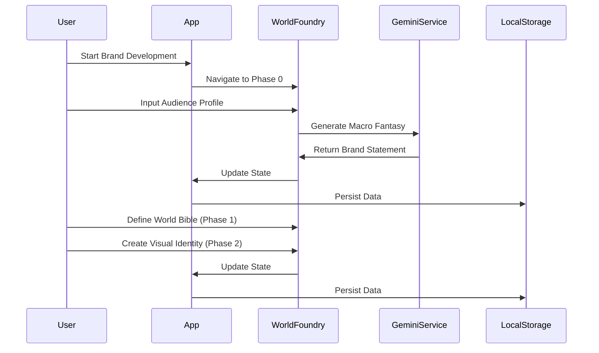

### 2. Content Creation Workflow

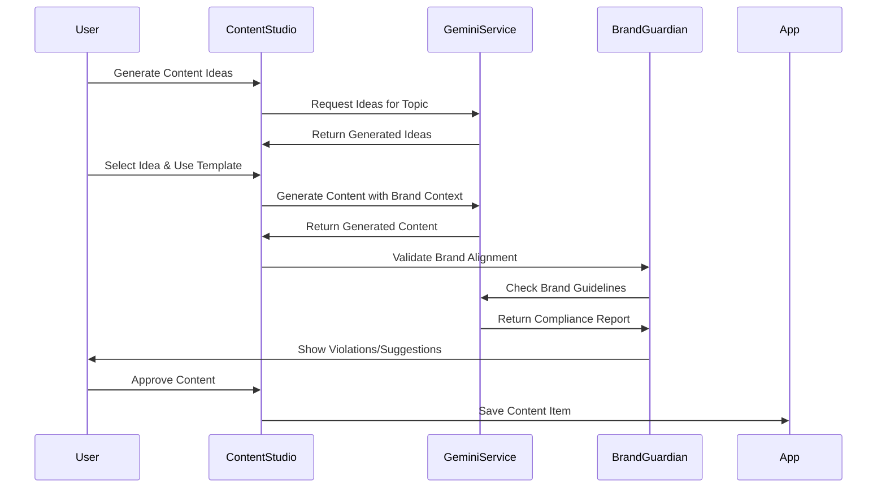

### 3. Brand Validation Workflow (L-M-A-I Framework)

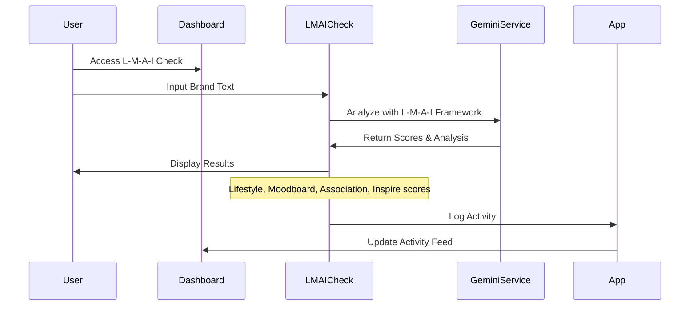

### 4. Phase Progression Workflow

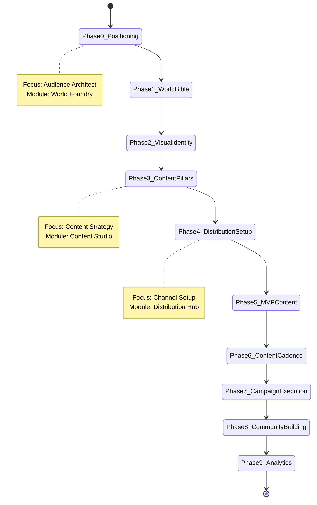

## Technology Stack

### Frontend Technologies

| Component | Technology | Version | Purpose |
|-----------|------------|---------|---------|
| **UI Framework** | React | ^19.1.0 | Component-based UI development |
| **Language** | TypeScript | ~5.7.2 | Type-safe development |
| **Routing** | React Router DOM | ^7.6.1 | Client-side routing |
| **Build Tool** | Vite | ^6.2.0 | Fast build and development |
| **Styling** | CSS/Tailwind | - | Component styling (inferred from className patterns) |

### Development Tools

| Tool | Version | Purpose |
|------|---------|---------|
| **Node Types** | @types/node ^22.14.0 | Node.js type definitions |
| **TypeScript** | ~5.7.2 | Type checking and compilation |
| **Vite** | ^6.2.0 | Development server and bundling |

### AI/ML Integration

| Service | Library | Purpose |
|---------|---------|---------|
| **Google Gemini AI** | @google/genai ^1.0.1 | Content generation, brand analysis, strategy development |

## External Integrations

### Google Gemini AI Integration

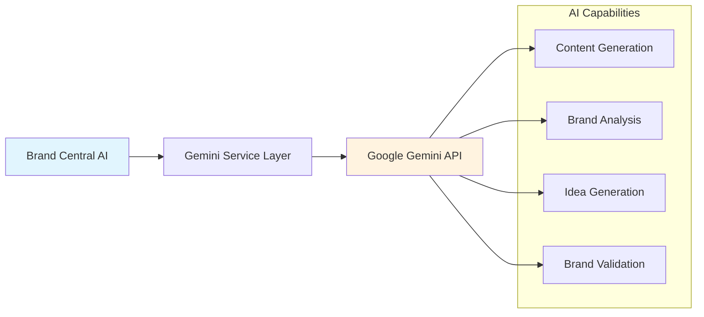

**Integration Details**:
- **Model Used**: `gemini-2.5-flash-preview-04-17`
- **Authentication**: API Key-based authentication
- **Fallback**: Mock responses when API key is unavailable
- **Rate Limiting**: Handled by Google's service
- **Error Handling**: Graceful degradation with user-friendly error messages

**AI-Powered Features**:
1. **L-M-A-I Framework Analysis**: Brand alignment scoring
2. **Macro Fantasy Generation**: Brand positioning statements
3. **Content Idea Generation**: Topic-based content brainstorming
4. **Prompt Refinement**: AI-enhanced prompt engineering
5. **Template-Based Content**: Structured content generation
6. **Brand Guardian**: Content compliance checking
7. **Community Engagement**: Suggested replies to user comments

## Deployment Architecture

### Client-Side Deployment

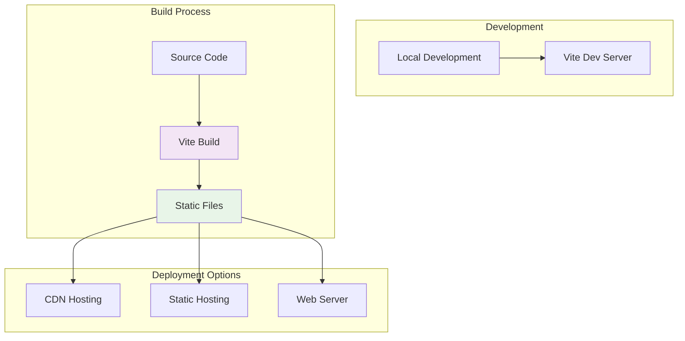

**Deployment Characteristics**:
- **Type**: Single Page Application (SPA)
- **Build Output**: Static files (HTML, CSS, JS)
- **Environment Variables**: Gemini API key configuration
- **Browser Requirements**: Modern browsers with ES2020 support
- **Storage**: Browser Local Storage for data persistence

## Security Considerations

### 1. API Key Management
- **Storage**: Environment variables for API keys
- **Exposure**: Client-side API key exposure (inherent SPA limitation)
- **Rotation**: Support for API key rotation without code changes
- **Fallback**: Graceful degradation when API keys are invalid

### 2. Data Privacy
- **Local Storage**: All user data stored locally in browser
- **No Server Storage**: No server-side data persistence reduces privacy risks
- **Data Export**: Users can export their data from Local Storage
- **Data Portability**: JSON format allows easy data migration

### 3. Content Security
- **Brand Guardian**: AI-powered content validation
- **Input Sanitization**: React's built-in XSS protection
- **Content Filtering**: Forbidden word lists in World Bible

### 4. Security Best Practices
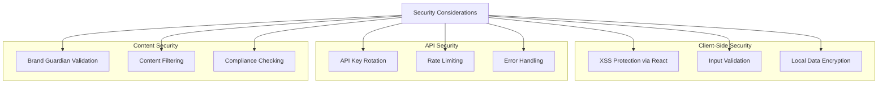

## Performance & Scalability

### 1. Performance Optimizations

**Frontend Performance**:
- **Code Splitting**: Modular component loading
- **Lazy Loading**: Component-based route loading
- **State Optimization**: Efficient React state management
- **Local Storage**: Fast data persistence and retrieval

**AI Service Performance**:
- **Response Caching**: Local caching of AI responses
- **Request Batching**: Efficient API usage
- **Error Recovery**: Retry mechanisms for failed requests
- **Mock Fallbacks**: Immediate responses when API unavailable

### 2. Scalability Considerations

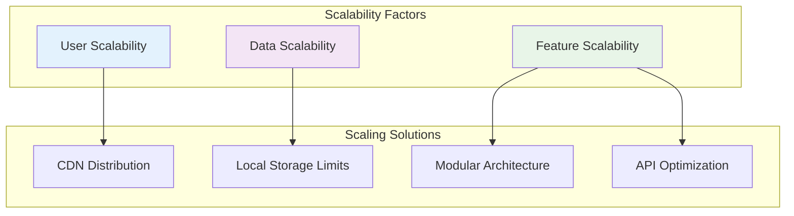

**Scalability Limitations**:
- **Local Storage**: 5-10MB browser storage limit
- **API Costs**: Direct client-to-API calls scale with user usage
- **Client Resources**: Heavy AI processing requires capable devices

**Scaling Strategies**:
- **Data Archiving**: Export/import functionality for large datasets
- **Progressive Loading**: Load data incrementally
- **Feature Flagging**: Enable/disable features based on user tiers
- **Caching Strategy**: Aggressive caching of AI responses

### 3. Monitoring & Analytics

**Client-Side Monitoring**:
- **Error Tracking**: Console error logging
- **Performance Metrics**: Load time tracking
- **User Activity**: Activity feed for user actions
- **API Usage**: Request/response logging

## Conclusion

Brand Central AI represents a modern, AI-powered approach to brand development with a clean, modular architecture. The application successfully balances sophisticated AI capabilities with user-friendly interfaces, while maintaining a lightweight, client-side deployment model. The phased approach to brand development, combined with integrated AI tools, provides a comprehensive solution for brand strategy and content creation.

The architecture is designed for:
- **Ease of Use**: Guided workflows and intelligent defaults
- **Flexibility**: Modular design allows for feature expansion
- **Performance**: Client-side architecture with efficient AI integration
- **Maintainability**: Clean separation of concerns and TypeScript safety

Future enhancements could include server-side components for team collaboration, enhanced data persistence, and additional AI model integrations. 